<p align="center">
  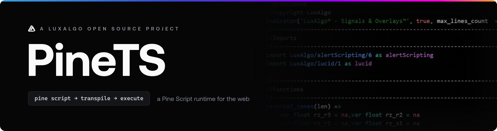
</p>

<p align="center">
  <strong>Pine Script® runtime for JavaScript</strong><br>
  Run TradingView® indicators in Node.js, browsers, and any JS environment.
</p>

<p align="center">
  <a href="https://www.luxalgo.com"></a>
  <a href="https://www.npmjs.com/package/pinets"></a>
  <a href="#license"></a>
  <a href="./.github/badges/coverage.svg"></a>
  <a href="#api-coverage"></a>
  <a href="https://docs.luxalgo.com/developers/pinets"></a>
  <a href="https://github.com/wilsonfreitas/awesome-quant"></a>
</p>

<p align="center">
  <a href="#quick-start">Quick Start</a> •
  <a href="#features">Features</a> •
  <a href="#usage">Usage</a> •
  <a href="#api-coverage">API Coverage</a> •
  <a href="#documentation">Docs</a> •
  <a href="#charting-with-vela">Vela</a>
</p>

## What is PineTS?

PineTS is a TypeScript runtime for [Pine Script®](https://www.TradingView.com/pine-script-docs/welcome/). It transpiles native v6 or v5 source and executes it with the same time series model: lookbacks, incremental TA, and plot outputs you can read from code.

You write the indicator once. PineTS runs it on your data, in your process.

**[Documentation](https://docs.luxalgo.com/developers/pinets)**

```javascript
import { PineTS, Provider } from 'pinets';

const pineTS = new PineTS(Provider.Binance, 'BTCUSDT', '1h', 100);

// Run native Pine Script® directly
const { plots } = await pineTS.run(`
//@version=6
indicator("EMA Cross")
plot(ta.ema(close, 9), "Fast", color.blue)
plot(ta.ema(close, 21), "Slow", color.red)
`);
```

> ***Disclaimer**: PineTS is an independently developed open source compiler and runtime engine. LuxAlgo Global, LLC and the PineTS project are NOT affiliated with, sponsored by, endorsed by, or in any way officially associated with TradingView, Inc. "Pine Script®" and "TradingView®" are registered trademarks of TradingView, Inc.*


## Why PineTS?

Pine Script® is built for the chart. PineTS is built for everything around it.


| You need                                            | PineTS gives you                               |
| --------------------------------------------------- | ---------------------------------------------- |
| Indicators on your own infrastructure               | Run them in Node.js, Deno, Bun, or the browser |
| Values you can pass to a bot, alert, or ML pipeline | Raw plot series as plain JavaScript            |
| Data from Binance, a CSV, or your own API           | Built in providers, or pass an OHLCV array     |
| The same script you already wrote                   | Native Pine Script® v6, no rewrite             |


## Quick Start


### Installation

```bash
npm install pinets
```


### Hello World

A minimal example:

```javascript
import { PineTS, Provider } from 'pinets';

// Initialize with Binance data
const pineTS = new PineTS(Provider.Binance, 'BTCUSDT', '1h', 100);

// Calculate a simple moving average
const { plots } = await pineTS.run(`
//@version=6
indicator("My First Indicator")
sma20 = ta.sma(close, 20)
plot(sma20, "SMA 20")
`);

console.log('SMA values:', plots['SMA 20'].data);
```

`plots` is a map of series you can log, store, or feed into the rest of your stack.

## Features

- **Native Pine Script® v6**: run original TradingView® code directly *(experimental)*
- **60+ TA functions**: SMA, EMA, RSI, MACD, Bollinger Bands, and more
- **Time series semantics**: lookbacks, `var` / `let` persistence, bar state
- **Live streaming**: recalculate on new bars with an event based API
- **Multiple timeframes**: `request.security()` for MTF indicators
- **High precision**: matches TradingView®'s calculation precision
- **Your data**: Binance, FMP, Alpaca, or any OHLCV array


### Two Ways to Write Indicators

PineTS accepts native Pine Script® or a JavaScript friendly syntax. Both compile to the same runtime.

**Native Pine Script®**

```pinescript
//@version=6
indicator("RSI Strategy")

rsi = ta.rsi(close, 14)
sma = ta.sma(rsi, 10)

plot(rsi, "RSI")
plot(sma, "Signal")
```


**PineTS Syntax (JavaScript)**

```javascript
//@PineTS
indicator('RSI Strategy');

const rsi = ta.rsi(close, 14);
const sma = ta.sma(rsi, 10);

plot(rsi, 'RSI');
plot(sma, 'Signal');
```


## Usage


### Running Native Pine Script®

Pass Pine Script® source to `pineTS.run()` and read the calculated series from `plots`:

```javascript
import { PineTS, Provider } from 'pinets';

const pineTS = new PineTS(Provider.Binance, 'BTCUSDT', 'D', 200);

const { plots } = await pineTS.run(`
//@version=6
indicator("MACD", overlay=false)

[macdLine, signalLine, hist] = ta.macd(close, 12, 26, 9)

plot(macdLine, "MACD", color.blue)
plot(signalLine, "Signal", color.orange)
plot(hist, "Histogram", color.gray, style=plot.style_histogram)
`);

// Access the calculated values
console.log('MACD Line:', plots['MACD'].data);
console.log('Signal Line:', plots['Signal'].data);
```


### Using PineTS Syntax

The same indicators can be written as a JavaScript function using `$.data` and `$.pine`:

```javascript
import { PineTS, Provider } from 'pinets';

const pineTS = new PineTS(Provider.Binance, 'ETHUSDT', '4h', 100);

const { plots } = await pineTS.run(($) => {
    const { close, high, low } = $.data;
    const { ta, plot, plotchar } = $.pine;

    // Calculate indicators
    const ema9 = ta.ema(close, 9);
    const ema21 = ta.ema(close, 21);
    const atr = ta.atr(14);

    // Detect crossovers
    const bullish = ta.crossover(ema9, ema21);
    const bearish = ta.crossunder(ema9, ema21);

    // Plot results
    plot(ema9, 'Fast EMA');
    plot(ema21, 'Slow EMA');
    plotchar(bullish, 'Buy Signal');
    plotchar(bearish, 'Sell Signal');

    return { ema9, ema21, atr, bullish, bearish };
});
```


### Streaming Live Data

`pineTS.stream()` recalculates on new bars and emits plot updates:

```javascript
import { PineTS, Provider } from 'pinets';

const pineTS = new PineTS(Provider.Binance, 'BTCUSDT', '1m');

const stream = pineTS.stream(
    `
    //@version=6
    indicator("Live RSI")
    plot(ta.rsi(close, 14), "RSI")
    `,
    { live: true, interval: 1000 },
);

stream.on('data', (ctx) => {
    const rsi = ctx.plots['RSI'].data.slice(-1)[0].value;
    console.log(`RSI: ${rsi.toFixed(2)}`);

    if (rsi < 30) console.log('Oversold!');
    if (rsi > 70) console.log('Overbought!');
});

stream.on('error', (err) => console.error('Stream error:', err));
```


### Custom Data Source

You can also pass your own OHLCV array instead of a market data provider:

```javascript
import { PineTS } from 'pinets';

// Your own OHLCV data
const candles = [
    { open: 100, high: 105, low: 99, close: 103, volume: 1000, openTime: 1704067200000 },
    { open: 103, high: 108, low: 102, close: 107, volume: 1200, openTime: 1704153600000 },
    // ... more candles
];

const pineTS = new PineTS(candles);

const { plots } = await pineTS.run(`
//@version=6
indicator("Custom Data")
plot(ta.sma(close, 10))
`);
```


## API Coverage

PineTS aims for complete Pine Script® API compatibility. See the [full coverage list](https://docs.luxalgo.com/developers/pinets/api-coverage). Current status:

### Data & Context

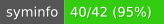
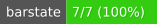
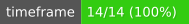
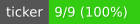
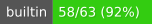
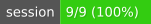

### Technical Analysis & Math

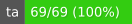


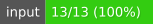

### Data Structures

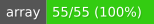


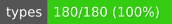

### Visualization

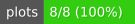

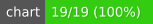
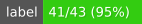
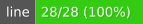
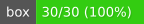
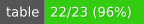


### Utilities

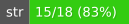
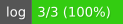
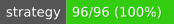

> Click any badge to open the [API coverage](https://docs.luxalgo.com/developers/pinets/api-coverage) page


## Documentation

Full guides live at **[docs.luxalgo.com/developers/pinets](https://docs.luxalgo.com/developers/pinets)**.

- [Getting Started](https://docs.luxalgo.com/developers/pinets/getting-started)
- [Initialization and Usage](https://docs.luxalgo.com/developers/pinets/initialization-and-usage)
- [Data Providers](https://docs.luxalgo.com/developers/pinets/data-providers)
- [Pagination and Live Streaming](https://docs.luxalgo.com/developers/pinets/pagination)
- [Architecture](https://docs.luxalgo.com/developers/pinets/architecture)
- [API Coverage](https://docs.luxalgo.com/developers/pinets/api-coverage)


## Charting with Vela

[Vela](https://github.com/LuxAlgo/Vela) is LuxAlgo's open-source charting library. It ships no scripting engine of its own. [Vela PineTS](https://github.com/LuxAlgo/Vela-pinets) is the addon that runs Pine Script® `indicator()` and `strategy()` scripts on the chart, through Vela's public `ScriptingEngine` port, in-process (`PineEngine`) or off the main thread (`PineWorkerEngine`).

<p align="center">
  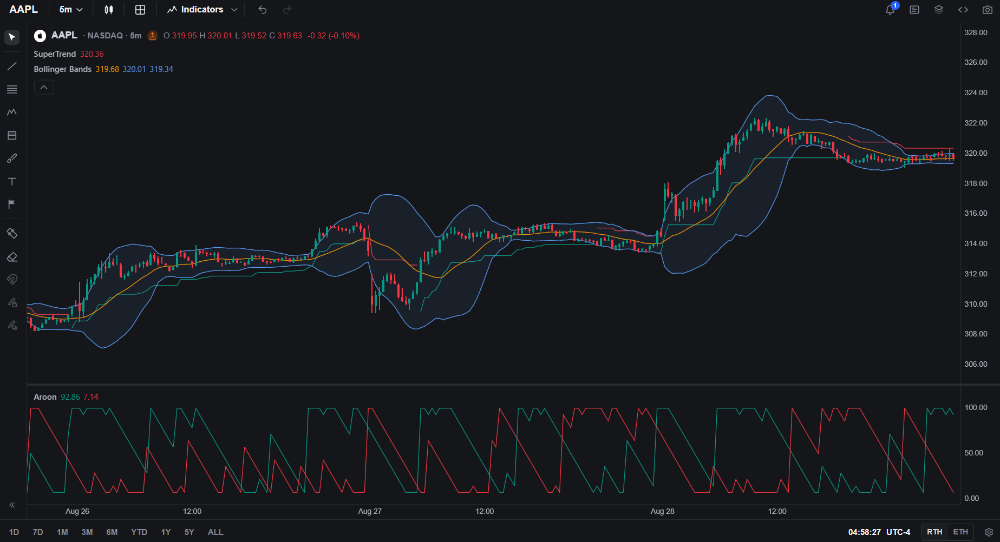
</p>

```bash
npm install @luxalgo/vela-pinets @luxalgo/vela pinets
```

```javascript
import { Vela } from '@luxalgo/vela';
import { PineEngine } from '@luxalgo/vela-pinets';

const chart = new Vela('#chart', { symbol: 'BTCUSDT', timeframe: '60', live: true });
chart.registerEngine('pine', new PineEngine());
chart.addIndicator(`
//@version=6
indicator("EMA 20", overlay=true)
plot(ta.ema(close, 20), color=color.orange, linewidth=2)
`);
```

Use `PineWorkerEngine` instead of `PineEngine` when a heavy script should not block the chart. A `strategy()` script runs through the same engine; Vela-pinets maps PineTS's broker-emulator trades onto Vela's price-pane trade markers. Mutable `indicator()` / `strategy()` declaration arguments appear on Vela's **Properties** tab.

**[Vela](https://github.com/LuxAlgo/Vela)** · **[Vela PineTS](https://github.com/LuxAlgo/Vela-pinets)** (`@luxalgo/vela-pinets`)


## Use Cases

**Algorithmic Trading**

- Build custom trading bots using Pine Script® strategies
- Connect indicators to your execution systems

**Backtesting**

- Test Pine Script® strategies against historical data
- Export indicator values for analysis in Python or R

**Alert Systems**

- Create custom alert pipelines based on indicator signals
- Monitor multiple assets with indicator calculations on the server

**Research & Analysis**

- Process large datasets with Pine Script® indicators
- Feed indicator outputs into machine learning models

**Custom Dashboards**

- Embed live indicators in web applications
- Build monitoring dashboards that update in real time


## Roadmap


| Status | Feature                                      |
| ------ | -------------------------------------------- |
| ✅      | Native Pine Script® v6 support               |
| ✅      | 60+ technical analysis functions             |
| ✅      | Arrays, matrices, and maps                   |
| ✅      | Live streaming                               |
| ✅      | Multiple timeframes via `request.security()` |
| ✅      | Strategy namespace                           |
| ✅      | Market data Providers                        |
| ✅      | Additional data providers                    |
| 🎯     | Pine Script® v6 full compatibility           |


## Contributing

Contributions are welcome. Before you start, read [CONTRIBUTING.md](CONTRIBUTING.md).

Useful ways to help:

- Add a missing Pine Script® function
- Improve docs or examples
- Fix a bug you can reproduce
- Open an issue with a script, expected output, and actual output


## Contributors

See [CONTRIBUTING.md](CONTRIBUTING.md) for the full guidelines.

Thanks to all PineTS contributors:

<p align="left">
<a href="https://github.com/alaa-eddine"></a>
<a href="https://github.com/dcaoyuan"></a>
<a href="https://github.com/C9Bad"></a>
<a href="https://github.com/aakash-code"></a>
<a href="https://github.com/alexgrover"></a>
<a href="https://github.com/amoradi"></a>
<a href="https://github.com/smack369"></a>
<a href="https://github.com/NexusAlien"></a>
<a href="https://github.com/yoonbae81"></a>
</p>


## License

PineTS is dual licensed:

- **[AGPL 3.0](./LICENSE)** : Free for everyone. You can use PineTS for personal projects, research, and internal tools without any obligation. The copyleft terms only apply if you **distribute** your application to others or **provide it as a network service** (e.g., SaaS, public API). In that case, your full source code must also be released under AGPL 3.0.
- **[Commercial License](./LICENSE-COMMERCIAL.md)** : For companies and individuals who want to use PineTS in proprietary or closed source software without AGPL 3.0 obligations. [Contact us for licensing](mailto:business@luxalgo.com).

Built by [LuxAlgo](https://www.luxalgo.com)  
Copyright (C) 2026-present LuxAlgo
